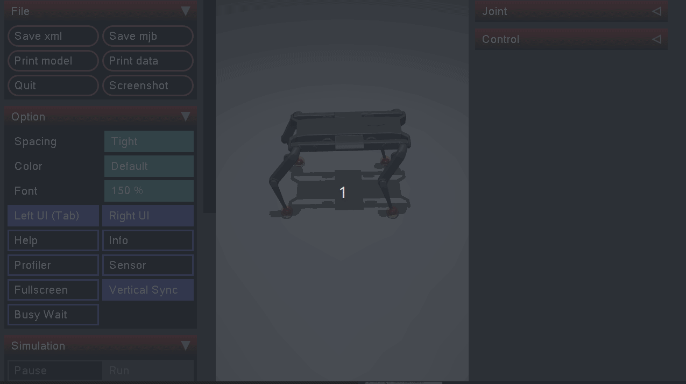

# FTN Solo
A repository for everything Solo related developed on FTN

## Instalation
```
sudo apt-get install python3-virtualenv

git clone git@github.com:ajsmilutin/ftn_solo.git

virtualenv solo_env && source solo_env/bin/activate
cd ftn_solo
pip install -r requirements.txt 
```

After finishing run the visualize script:
```
python visualize.py 
```

And you should be able to see something like this:
