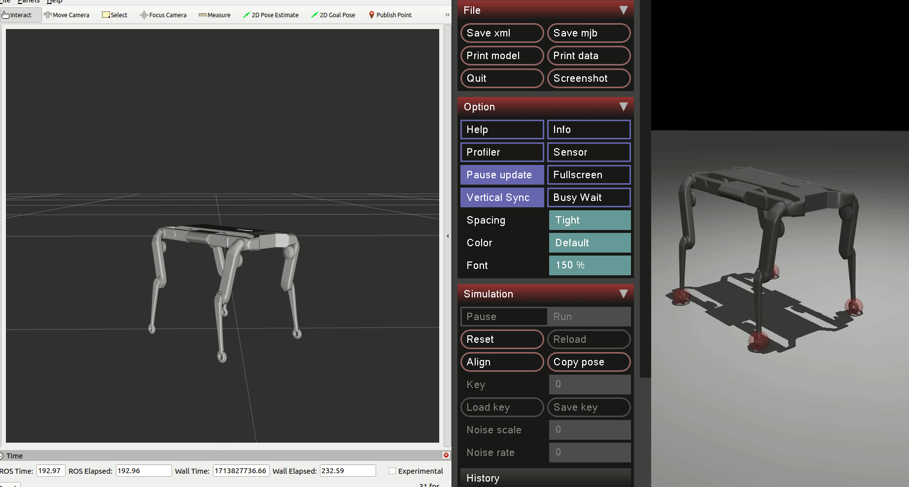

# FTN Solo
A repository for everything Solo related developed on FTN

## Instalation

### ROS
First thing to install is definitely ROS2. To do so, follow the instructions [here](https://docs.ros.org/en/humble/Installation/Ubuntu-Install-Debians.html)

### Prepparing the environment
First of all let's create ROS2 workspace and clone the repositories needed

```
export INSTALL_DIR=<give_him_some_name>
mkdir -p $INSTALL_DIR/src
cd $INSTALL_DIR/src
git clone git@github.com:ajsmilutin/robot_properties_solo.git
git clone git@github.com:ajsmilutin/ftn_solo.git
cd ..
```

Then let's install the python dependencies:
```
sudo apt-get install python3-virtualenv

virtualenv solo_env
source solo_env/bin/activate
pip install -r src/ftn_solo/requirements.txt 
touch solo_env/COLCON_IGNORE
```

Let's now compile (twice) and run some demo!:
```
source /opt/ros/humble/setup.bash
colcon build && source install/setup.bash
# HACK! We need 2 compiles of robot_propperties_solo
colcon build --packages-select robot_properties_solo && source install/setup.bash 
ros2 launch ftn_solo robot_launch.py hardware:=mujoco task:=joint_spline
```
And you should be able to see something like this:

